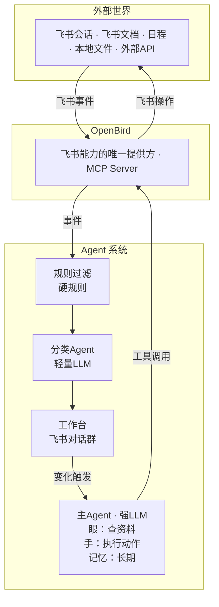

# 通用 Agent 架构设计

## 设计哲学

- **仿生作为架构参考，不是能力上限**：自然界进化出的结构代表高效率的解法，架构上学习自然界；但能力上超越自然界，因为数字系统天然在某些维度（记忆、注意力带宽、一致性、不遗漏）比生物更强
- **效率驱动**：架构选择以效率为最高优先级，自然界是参考答案
- **有利于演进**：保持最小设计，不过度规定，为未来快速演进留空间

## 核心概念

### 1. 刺激

来自外部世界的信号（飞书消息、日程变更、定时消息触发等）。刺激只是"闹钟"，唤醒 Agent 去看当前状态。刺激本身不决定 Agent 做什么——Agent 的行动由全局状态决定。

**刺激与行动彻底解耦**：刺激从会话 A 进来，Agent 可能在会话 B 行动；也可能什么都不做，只更新记忆。

### 2. 事

协作的最小单位。不是"消息"，不是"会话"，而是一件需要被处理和闭环的事务。

Agent 的核心职责标准：**事事有回应**。

一条消息可能包含多件事，一件事可能横跨多个会话。"事"的识别和拆解由 Agent 完成。

### 3. 工作台

一个普通的飞书对话群。老板和 Agent 的共享工作空间。

- 所有的"事"在这里被沟通、推进、闭环
- 老板和 Agent 地位对等，双方都可以发起"事"、推进"事"、请求对方协助
- 利用飞书定时消息实现定时任务（详见"定时任务"章节）
- 同时也是 Agent 的配置界面——通过自然语言对话完成配置变更

## 整体架构



## 处理管线

### 第一层：规则过滤（零成本）

硬规则，不需要 LLM。作用于**外部信号**（飞书会话中的事件），在进入 Agent 系统之前砍掉大部分噪音：

- 忽略系统通知
- 忽略机器人消息
- 只关注特定群 / @我的消息

注意：此层只过滤外部信号。工作台内的变化走另一条路径，直接触发主 Agent。

### 第二层：分类 Agent（轻量 LLM）

只做一件事——判断这个刺激跟什么"事"有关：

- 属于工作台里已有的事 → 把信息追加到工作台
- 是一件新的事 → 在工作台里发起新话题
- 不构成任何"事" → 丢弃（第二层过滤）

### 第三层：主 Agent（强 LLM）

被工作台变化触发，看全局状态，决定行动：

- 需要查资料 → 用"眼"（搜索文档、读代码、查数据库、调 API）
- 需要执行 → 用"手"（发消息、建日程、调 API）
- 需要跟老板沟通 → 在工作台里发消息
- 需要定时 → 编辑定时消息队列
- 不需要行动（如最新消息是自己发的，在等老板回复）→ 结束本轮

## Barge-in 机制

借鉴语音对话的打断处理模式。Agent 执行动作过程中如果工作台有新变化：

- 已执行的动作不撤回
- 未执行的动作丢弃
- 基于最新状态重新思考和行动

## 关于 Agent 触发自身的处理

Agent 更新工作台也会触发新一轮处理，这没关系：

- Agent 醒来，看到最新消息是自己发的
- 判断：正在等老板回复 / 没有新的事需要处理
- 结束本轮

不需要特殊的防循环机制，Agent 自己能判断何时该行动、何时该等待。

## 定时任务

利用飞书定时消息实现，不依赖外部定时系统。

**限制**：飞书每人在一个群里只能有一条待发送的定时消息，但可以编辑。

**方案**：定时消息的内容是一个按时间排序的任务队列：

```
⏰ 17:00 提醒老板开会
⏰ 17:30 回复李四报价单
⏰ 明天 9:00 给张三打电话
⏰ 周五 14:00 提交周报

定时发送时间 = 队列中第一项的时间
```

当定时消息发出后：

1. 消息作为新刺激触发 Agent
2. Agent 执行第一项任务
3. Agent 用剩余队列创建新的定时消息，发送时间 = 下一项的时间

新任务插入时按时间排序，如果新任务排在最前面，则编辑定时消息的发送时间。

## 工具体系

### 飞书相关工具

全部通过 OpenBird（MCP Server）提供。Agent 不直接对接飞书 API。需要新的飞书能力，在 OpenBird 里添加。

### 非飞书工具

按需独立接入：

- 本地文件读取
- 外部 API 调用
- 数据库查询
- 其他 MCP Server

工具通过 MCP 协议连接，天然可插拔。

## 记忆系统

### 短期记忆

工作台本身就是短期记忆——正在进行的事、跟老板的对话、定时任务队列，全在飞书群聊记录里。飞书即持久化层。

### 长期记忆

保持最小设计，为未来演进留空间。

核心是**员工手册**——Agent 的行为准则文档，由 Agent 从日常工作台对话中自动提炼、由老板确认生效。手册从空白开始，随培养过程生长。

详见 [Agent 产品哲学与培养范式](./2026-03-03-agent-philosophy-and-training-paradigm.md) 第 4 节。

## 设计原则总结

1. **"事"是最小单位**——事事有回应
2. **刺激与行动解耦**——刺激只是唤醒，行动由全局状态决定
3. **工作台是状态中心**——老板和 Agent 对等协作
4. **飞书原生能力复用**——定时消息 = 定时任务，对话群 = 工作台
5. **用户零门槛**——老板只需要在飞书群里说话
6. **零配置**——除初始模型配置外，所有配置变更通过工作台自然语言对话完成
7. **模块可插拔**——LLM 可换，工具按需加，通过 MCP 协议连接
8. **按职能分脑**——分类用轻量模型，决策用强模型
9. **有利于演进**——保持最小设计，不过度抽象，为未来快速演进留空间
